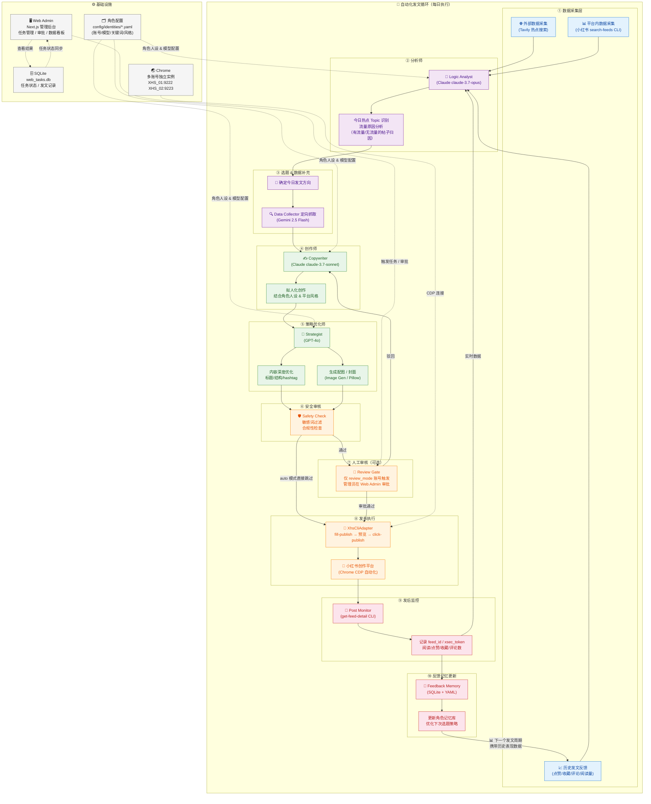

# 社交媒体自动化系统架构图

## 各角色职责说明

| 角色 | 模型 | 职责 |
|------|------|------|
| **Data Collector** | Gemini 2.5 Flash | 外部热点抓取 + 小红书内搜索 + 读取历史反馈 |
| **Logic Analyst** | Claude claude-3.7-opus | 分析今日 Topic / 流量归因 / 内容策略建议 |
| **Copywriter** | Claude claude-3.7-sonnet | 拟人化创作，结合角色人设写小红书风格文案 |
| **Strategist** | GPT-4o | 二次优化：标题、结构、hashtag、配图方向 |
| **Safety Check** | 规则引擎 | 敏感词过滤 + 合规性检查 |
| **Review Gate** | 人工 | 仅 review 模式账号触发，Web Admin 页面审批 |
| **XhsCliAdapter** | CDP 自动化 | fill-publish → 人工预览 → click-publish |
| **Post Monitor** | CLI | 发布后定时拉取阅读/互动数据 |
| **Feedback Memory** | SQLite | 将本次表现写回记忆库，影响下次选题和创作策略 |

## 当前缺失 / 待实现

- [ ] **自动触发循环**：目前需要手动在 Web Admin 创建任务，缺少定时调度器（cron/scheduler）
- [ ] **分析师介入选题**：Logic Analyst 目前主要做内容安全分析，尚未实现流量归因 → 选题建议的闭环
- [ ] **策略优化师配图**：图片生成逻辑（Image Gen）尚未完整对接，目前仅有 Pillow 生成占位封面
- [ ] **社交互动引擎**：`social_interaction.py` 已实现但未集成进主循环（点赞/评论/互动趋势）
